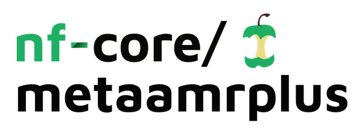

<!-- <h1>
  <picture>
    <source media="(prefers-color-scheme: dark)" srcset="docs/images/nf-core-metaamrplus_logo_dark.png">
    
  </picture>
</h1>

[](https://github.com/nf-core/metaamrplus/actions/workflows/ci.yml)
[](https://github.com/nf-core/metaamrplus/actions/workflows/linting.yml)[](https://nf-co.re/metaamr/results)[](https://doi.org/10.5281/zenodo.15682600)
[](https://www.nf-test.com)

[](https://www.nextflow.io/)
[](https://github.com/nf-core/tools/releases/tag/3.5.2)
[](https://docs.conda.io/en/latest/)
[](https://www.docker.com/)
[](https://sylabs.io/docs/)
[](https://cloud.seqera.io/launch?pipeline=https://github.com/nf-core/metaamrplus)

[](https://nfcore.slack.com/channels/metaamr)[](https://twitter.com/nf_core)[](https://mstdn.science/@nf_core)[](https://www.youtube.com/c/nf-core) -->

<h1>Meta-AMR-Plus</h1>

[](https://doi.org/10.5281/zenodo.15682600)

## Introduction

**Meta-AMR-Plus** is a NextFlow pipeline designed for analyzing long-read Nanopore metagenomic data. It detects antimicrobial resistance (AMR) genes, identifies plasmids, and performs taxonomic classification using multiple tools and reference databases. The pipeline processes sequencing data efficiently and generates standardized output tables, making it easier to compare results across different tools and datasets.


## Features

1. Read QC ([`FastQC`](https://www.bioinformatics.babraham.ac.uk/projects/fastqc/))
2. Performs read pre-processing
  - Adapter clipping and merging (`porechop`)
  - Low complexity and quality filtering (`Filtlong`)
  - Host-read removal (`Minimap2`)
3. Generates statistics for host-read removal using `Samtools`.
4. Performs optional genome assembly with `Flye` and assesses assembly quality using `QUAST`.
5. Optionally polishes the assembly using `Racon`.
6. Optionally downloads databases for AMR detection tools and PlasmidFinder if not provided by the user.
7. Performs AMR detection on assembled data using one or more of:
  - `ResFinder`
  - `AMRFinderPlus`
  - `CARD-RGI`
  - `Abricate` and
  - `ResFinder` on unassembled reads.
8. Optionally performs `hAMRonization` to generate a comprehensive report integrating results from multiple AMR detection tools.
9. Performs plasmid detection assembled data using:
  - `PlasmidFinder`
  - `PlasClass`
10. Performs taxonomic classification using `Centrifuge` and `Kaiju`.
11. Generates visualizations for Centrifuge and Kaiju results using `Krona`.
12. Presents quality control and summary statistics for preprocessing, assembly, taxonomic classification, host-read removal, and AMR detection using ResFinder, AMRFinderPlus, CARD-RGI, and Abricate (`MultiQC`).


## Usage

<!-- > [!NOTE]
> If you are new to Nextflow and nf-core, please refer to [this page](https://nf-co.re/docs/usage/installation) on how to set-up Nextflow. Make sure to [test your setup](https://nf-co.re/docs/usage/introduction#how-to-run-a-pipeline) with `-profile test` before running the workflow on actual data. -->

<!-- TODO nf-core: Describe the minimum required steps to execute the pipeline, e.g. how to prepare samplesheets.
     Explain what rows and columns represent. For instance (please edit as appropriate):-->

First, prepare a samplesheet with your input data that looks as follows:

**`samplesheet.csv`**:

|sample|fastq_1          |
|------|-----------------|
|sg17  |sample17.fastq.gz|
|sg18  |sample18.fastq.gz|
|sg19  |sample19.fastq.gz|

Each row represents a fastq file (single-end).

Additionally, you will need a database sheet that looks as follows:

**`samplesheet.csv`**:

|tool|db_name          |db_params|db_path                         |
|----|-----------------|---------|--------------------------------|
|kaiju|kaiju_db         |         |`/<path>/<to>/kaiju_db`           |
|centrifuge|centrifuge_db    |         |`/<path>/<to>/centrifuge_database`|

The db_path column should point to directories or .tar.gz archives containing the databases required for the selected tools. For Kaiju and Centrifuge, pre-existing databases must be provided. For other tools, you can either provide the database path, or the pipeline will automatically generate the required database if not supplied.

> [!NOTE]
> Abricate and PlasClass come with built-in databases, so no external database input is required for them.


Now, you can run the pipeline using:
```bash
nextflow run ./main.nf \
   -profile docker \
   --input samplesheet.csv \
   --databases database.csv \
   --outdir results \
   --perform_assembly \
   --perform_polish_assembly \
   --run_resfinder \
   --download_resfinder_db \
```

<!-- TODO nf-core: update the following command to include all required parameters for a minimal example -->

<!-- ```bash
nextflow run nf-core/metaamrplus \
   -profile <docker/singularity/.../institute> \
   --input samplesheet.csv \
   --outdir <OUTDIR>
``` -->

<!-- > [!WARNING]
> Please provide pipeline parameters via the CLI or Nextflow `-params-file` option. Custom config files including those provided by the `-c` Nextflow option can be used to provide any configuration _**except for parameters**_; see [docs](https://nf-co.re/docs/usage/getting_started/configuration#custom-configuration-files).

For more details and further functionality, please refer to the [usage documentation](https://nf-co.re/metaamr/usage) and the [parameter documentation](https://nf-co.re/metaamr/parameters). -->

## Pipeline output

To see the results of an example test run with a full size dataset refer to the [results](https://nf-co.re/metaamr/results) tab on the nf-core website pipeline page.

For more details about the output files and reports, please refer to the
[output documentation](https://nf-co.re/metaamr/output).

## Credits

**Meta-AMR-Plus** was originally written by Leila Nasirzadeh.

We thank the following people for their contributions to the development of this pipeline: \
  - [Jyotirmoy Das](https://github.com/JD2112) \
  - [Debojyoti Das](https://github.com/BioDebojyoti)
<!-- TODO nf-core: If applicable, make list of people who have also contributed -->

## Contributions and Support

<!-- If you would like to contribute to this pipeline, please see the [contributing guidelines](.github/CONTRIBUTING.md). -->

<!-- For further information or help, don't hesitate to get in touch on the [Slack `#metaamrplus` channel](https://nfcore.slack.com/channels/metaamr) (you can join with [this invite](https://nf-co.re/join/slack)). -->

## Citations

<!-- TODO nf-core: Add citation for pipeline after first release. Uncomment lines below and update Zenodo doi and badge at the top of this file. -->
<!-- If you use nf-core/metaamrplus for your analysis, please cite it using the following doi: [10.5281/zenodo.XXXXXX](https://doi.org/10.5281/zenodo.XXXXXX) -->

<!-- TODO nf-core: Add bibliography of tools and data used in your pipeline -->

<!-- An extensive list of references for the tools used by the pipeline can be found in the [`CITATIONS.md`](CITATIONS.md) file.

You can cite the `nf-core` publication as follows:

> **The nf-core framework for community-curated bioinformatics pipelines.**
>
> Philip Ewels, Alexander Peltzer, Sven Fillinger, Harshil Patel, Johannes Alneberg, Andreas Wilm, Maxime Ulysse Garcia, Paolo Di Tommaso & Sven Nahnsen.
>
> _Nat Biotechnol._ 2020 Feb 13. doi: [10.1038/s41587-020-0439-x](https://dx.doi.org/10.1038/s41587-020-0439-x). -->
